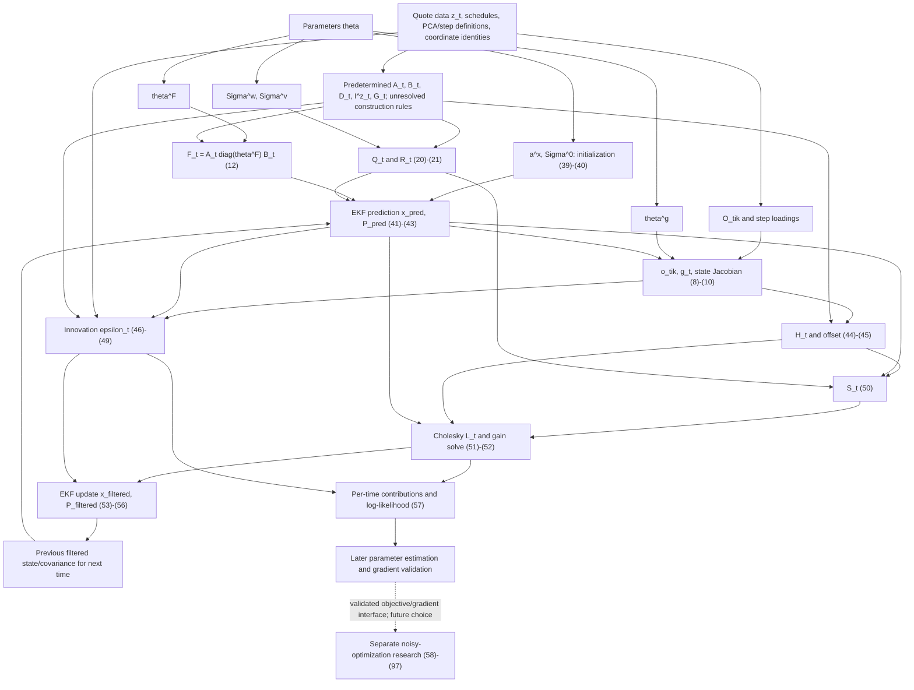

# Mathematical model specification

This document addresses [issue #1](https://github.com/isakekbom/kalmanfilter/issues/1) only. It reconstructs [kalmanRante.pdf](../kalmanRante.pdf), *Forward Rates Futures*, Jörgen Blomvall, dated August 19, 2026, following [roadmap.md](../roadmap.md). It specifies mathematical objects and proposed implementation names; it does not implement a filter, a project skeleton, parameter transforms, or an optimizer.

Source snapshot: repository commit `e2445cccace8ea5e376a0ca490fb890f1737560b`; PDF SHA-256 `04453744d4ce0230a78b1ac453189d7b85a43f088f2719e16972f617cb177801`. Page numbers below are the PDF's printed pages. Equation numbers were checked against rendered pages: text extraction alone misaligns several numbers, especially (46)–(56).

## 1. Scope and reading conventions

| Layer | PDF location | Purpose and boundary |
| --- | --- | --- |
| OIS pricing | §1, p. 2, (1)–(10) | Discount factors, par swap quotes, and quote derivatives with respect to systematic states. |
| State-space model and EKF | §2, pp. 3–5, (11)–(22), (33)–(56) | Latent dynamics, observations, Gaussian noise, and one forward EKF pass for given parameters. |
| Parameter estimation | §2.1, pp. 4–5, (23)–(37), (57) | Additional structural restrictions and the innovation log-likelihood evaluated by the EKF. |
| Noisy optimization research | §3–3.1, pp. 5–8, (58)–(97) | A draft for fitting local quadratics to noisy objective/gradient evaluations. This is a later experimental layer, independent of the core filtering equations. |

Statements marked **PDF** are explicit in the source. **Derived** means algebra or dimensional compatibility, not a new modeling assumption. **Proposed** identifies an implementation convention or an additional assumption requiring a future decision. Unresolved matters have identifiers in [Open questions](#10-open-questions); this document does not select answers for them. The absence of reference data and the supervisor's MATLAB code prevents resolving operational details by comparison.

The PDF uses column vectors, semicolons for vertical concatenation, and the same superscript position for factor labels, conditioning times, and transposes. In particular, $x_t^{t-1,s}$ is the systematic part of the prediction at $t$ conditional on observations through $t-1$; it is not a power. $\Sigma^0$ is an initial covariance, not the zero matrix. $\theta^F,\theta^g,\Sigma^w,\Sigma^v,a^x$ retain the PDF's superscripts; roadmap names such as `theta_F` and `Sigma_w` are aliases.

**Proposed storage convention:** a mathematical $d\times1$ column is a one-dimensional array `(d,)`; matrices keep `(rows, columns)`, and scalars use `()`. Transposes in the equations describe mathematical orientation; a stored vector's `.T` does not create a row. A scalar quote gradient is stored `(n_s_t,)`, and the vector quote Jacobian has output rows. All proposed numerical arrays are real float64, as required by the roadmap; indices and masks are integer/Boolean. Time-varying arrays are per-time objects; a dense stack, padding convention, and JAX execution strategy are not specified here.

## 2. Symbol table and dimensions

These tables cover the model, the EKF, and the separate research notation. Sizes are symbolic because the PDF supplies no numerical counts. Implementation names are proposals, not existing functions or files.

### 2.1 Indices, sizes, and operators

| PDF symbol | Meaning | Mathematical dimension / proposed shape | Time dependence | Proposed name |
| --- | --- | --- | --- | --- |
| $t,T$ | Observation time index and final index, $t=1,\ldots,T$; initial time is 0 | Integer scalars | Index / fixed horizon | `time_index`, `n_times` |
| $i$ in $g_{t,i}$ | Instrument/quote row; distinct from the floating-leg tuple index $i$ | Integer scalar | Instrument set may change with $t$ | `instrument_index` |
| $n_t^x,n_t^s,n_t^u$ | Full, systematic, and unsystematic state counts | Integer scalars | May vary with $t$ | `n_x_t`, `n_s_t`, `n_u_t` |
| $n_t^p,n_t^c$ | PCA and central-bank-step state counts | Integer scalars | May vary with $t$ | `n_p_t`, `n_c_t` |
| $n_t^z$ | Number of observations at time $t$ | Integer scalar | Explicitly variable | `n_z_t` |
| $n^g$ | Dimension of $\theta^g$ | Integer scalar | Fixed as written | `n_g` |
| No PDF symbol: $n_F,n_w,n_v$ | Dimensions of $\theta^F$, base process noise, and base observation noise | Integer scalars introduced here for shape bookkeeping | Fixed if the corresponding parameter objects are fixed | `n_f`, `n_w`, `n_v` |
| $\mathbb R$, $\mathcal N(\mu,C)$ | Real numbers and Gaussian law with mean $\mu$, covariance $C$ | A law on the dimension of $\mu$ | Context dependent | No stored object; `mean`, `covariance` |
| $I,0$ | Identity and zero objects | Shape dictated by each equation; never assume a single global size | May vary with $t$ | `identity_x`, appropriately sized zeros |
| $\operatorname{diag}(\theta^F)$ | Diagonal matrix of transition coefficients | $n_F\times n_F$ / `(n_f,n_f)` | Fixed for one parameter evaluation | `transition_diagonal` |
| $(\cdot)^T$, $\nabla$, $\lvert\cdot\rvert$, $\ln$, $\exp$, $\sum$ | Transpose, derivative, determinant (or set cardinality), natural logarithm, exponential, summation | As indicated by operand; determinant/log terms are scalar | Context dependent | Mathematical operations |

**Derived identities:** $n_t^x=n_t^s+n_t^u$ and $n_t^s=n_t^p+n_t^c$. The dimensions $n_F,n_w,n_v$ are not additional statistical parameters. Their compatibility with the specialized assumptions (23)–(29) is unresolved when dimensions change (Q4).

### 2.2 OIS pricing symbols

| PDF symbol | Meaning / source | Mathematical dimension / proposed shape | Time dependence | Proposed name |
| --- | --- | --- | --- | --- |
| $N$ | Notional, (1)–(5) | Scalar / `()` | Per instrument; suppressed in PDF | `notional` |
| $y$ | Fixed par swap rate, (2)–(7) | Scalar / `()` | Per valuation/instrument | `par_rate` |
| $P_{float},P_{fix},P$ | Floating-leg value, fixed-leg value, net pay-fixed value | Scalars / `()` | Per valuation/instrument | `pv_float`, `pv_fixed`, `pv_swap` |
| $\mathcal F,(i,j,k)$ | Set of floating-leg date-index triples: start, end, payment | Set; proposed integer array `(n_float_periods,3)` | Per schedule | `float_period_indices` |
| $K,k$ | Number/index of fixed payments; $k=0$ used for the start loading in (9) | Integer scalars | Per schedule; do not assume a common $K$ for all instruments | `n_payments`, `payment_index` |
| $T_0,\bar T_0$ | Valuation/normalization date and floating start date, equated before (3) | Date/time scalars | Per schedule | `valuation_date`, `float_start_date` |
| $\bar T_i,\bar T_j,\bar T_k$ | Floating accrual start/end/payment dates in a triple | Date/time scalars; arrays by schedule | Per schedule | `float_accrual_start`, `float_accrual_end`, `float_payment_date` |
| $\tilde T_k,\tilde T_K$ | Fixed-leg payment date and final fixed payment date | Date/time scalars; `(n_payments,)` for the schedule | Per schedule | `fixed_payment_dates`, `maturity_date` |
| $i_l,j_l,k_l,n,l$ in the text before (7) | Ordered floating-period indices, count $n$, and period counter $l$; unrelated to research dimension $n$ | Integer scalars / ordered triples | Per schedule | `float_start_index`, `float_end_index`, `float_pay_index`, `n_float_periods`, `float_period_index` |
| $t_k^c$ | Fixed coupon accrual factor in (2)–(10); convention/units not supplied | Scalar; schedule `(n_payments,)` | Per schedule | `accrual_factors` |
| $d(T)$ | Discount factor at date $T$ relative to the source's curve convention | Scalar / `()` | Valuation time implicit in (1)–(7), explicit through state/loadings in (8) | `discount_factor` |
| $o_{t,i,k}$ | Log-discount loading, including start $k=0$ | $n_t^s\times1$ / `(n_s_t,)` | $t,i,k$ and $\theta^g$ | `discount_loading` |
| $O_{t,i,k}$ | Linear map from $\theta^g$ to PCA loading block, text after (10) | $n_t^p\times n^g$ / `(n_p_t,n_g)` | $t,i,k$ | `pca_loading_map` |
| $o_{t,i,k}^{(2)}$ | Lower, central-bank loading block | $n_t^c\times1$ / `(n_c_t,)`, derived | $t,i,k$; no explicit $\theta^g$ dependence in the displayed block | `step_loading` |
| $g_{t,i}(x_t^s)$, $g_t(\theta^g,x_t^s)$ | Scalar OIS quote and vector of modeled quotes | Scalar / `()`; $n_t^z\times1$ / `(n_z_t,)` | $t,\theta^g,x_t^s$ | `ois_quote`, `observation_quotes` |
| $\nabla_{x_t^s}g_{t,i}$ | Scalar quote gradient, (10) | $n_t^s\times1$ / `(n_s_t,)` | $t,i,\theta^g,x_t^s$ | `quote_state_gradient` |
| $\nabla_{x^s}g_t$ | Vector quote Jacobian in (38), (44)–(48) | $n_t^z\times n_t^s$ / `(n_z_t,n_s_t)`, derived orientation | $t,\theta^g$, evaluation state | `quote_state_jacobian` |

### 2.3 State-space and parameter symbols

| PDF symbol | Meaning / source | Mathematical dimension / proposed shape | Time dependence | Proposed name |
| --- | --- | --- | --- | --- |
| $x_t,x_t^s,x_t^u$ | Full state, systematic curve factors, instrument deviations | $n_t^x\times1$, $n_t^s\times1$, $n_t^u\times1$ / `(n_x_t,)`, `(n_s_t,)`, `(n_u_t,)` | $t$ | `state`, `state_systematic`, `state_unsystematic` |
| $x_t^p,x_t^c$ | PCA scores and central-bank forward-curve steps | $n_t^p\times1$, $n_t^c\times1$ / `(n_p_t,)`, `(n_c_t,)` | $t$ | `state_pca`, `state_steps` |
| $z_t$ | Observed market quotes, (13) | $n_t^z\times1$ / `(n_z_t,)` | $t$ | `observations` |
| $w_t,v_t$ | Additive process and measurement noise | $n_t^x\times1$, $n_t^z\times1$ / `(n_x_t,)`, `(n_z_t,)` | $t$ | `process_noise`, `observation_noise` |
| $\theta^F$ | Transition diagonal coefficients | $n_F\times1$ / `(n_f,)` | Fixed for a parameter evaluation | `theta_f` |
| $F_t(\theta^F)$ | State transition, (11)–(12) | $n_t^x\times n_{t-1}^x$ / `(n_x_t,n_x_prev)` | $t,\theta^F$ | `transition_matrix` |
| $A_t$ | Predetermined post-diagonal structural map | $n_t^x\times n_F$ / `(n_x_t,n_f)`, derived | $t$ | `transition_post_map` |
| $B_t$ | Predetermined pre-diagonal structural map | $n_F\times n_{t-1}^x$ / `(n_f,n_x_prev)`, derived | $t$ | `transition_pre_map` |
| $D_t$ | Base process-covariance map | $n_t^x\times n_w$ / `(n_x_t,n_w)`, derived | $t$ | `process_noise_map` |
| $I_t^z$ | Maps instrument deviations to observed rows | $n_t^z\times n_t^u$ / `(n_z_t,n_u_t)` | $t$ | `observation_selector` |
| $G_t$ | Base observation-covariance map | $n_t^z\times n_v$ / `(n_z_t,n_v)`, derived | $t$ | `observation_noise_map` |
| $\Sigma^w,\Sigma^v$ | Base process and observation covariances | $n_w\times n_w$, $n_v\times n_v$ / `(n_w,n_w)`, `(n_v,n_v)` | Fixed as written | `sigma_w`, `sigma_v` |
| $a^x,\Sigma^0$ | Initial-state mean and covariance | $n_0^x\times1$, $n_0^x\times n_0^x$ / `(n_x_0,)`, `(n_x_0,n_x_0)` | Initial time; parameters | `initial_mean`, `initial_covariance` |
| $\theta^g$ | Pricing/loading parameters | $n^g\times1$ / `(n_g,)` | Fixed for a parameter evaluation | `theta_g` |
| $\theta$ | Tuple $(\theta^F,\Sigma^w,\Sigma^v,a^x,\Sigma^0,\theta^g)$ | Structured tuple of the six declared shapes, not yet a flat vector | Fixed for each EKF pass | `model_parameters` |
| $f_0^x,f_t^w,f_t^v$ | Initial, process, and observation densities in (14)–(19) | Scalar outputs on `(n_x_0,)`, `(n_x_t,)`, `(n_z_t,)` respectively | $0$ or $t$ | `initial_density`, `process_density`, `observation_density` |
| No PDF symbol: $Q_t,R_t$ | Shorthand here for $D_t\Sigma^wD_t^T$, $G_t\Sigma^vG_t^T$ | $n_t^x\times n_t^x$, $n_t^z\times n_t^z$ / `(n_x_t,n_x_t)`, `(n_z_t,n_z_t)` | $t,\theta$ | `process_covariance`, `observation_covariance` |

The $Q_t$ shorthand is unrelated to the research quadratic $Q_k$. A diagonal base covariance does not imply diagonal mapped covariance for arbitrary $D_t,G_t$, or diagonal filtered state covariance.

### 2.4 EKF and likelihood symbols

| PDF symbol | Meaning / source | Mathematical dimension / proposed shape | Time dependence | Proposed name |
| --- | --- | --- | --- | --- |
| $x_0^0,P_0^0$ | Initialized mean/covariance, (31)–(32), (39)–(40) | $n_0^x\times1$, $n_0^x\times n_0^x$ / `(n_x_0,)`, `(n_x_0,n_x_0)` | Initialization | `initial_filtered_state`, `initial_filtered_covariance` |
| $x_{t-1}^{t-1},P_{t-1}^{t-1}$ | Previous filtered mean/covariance | $n_{t-1}^x\times1$, $n_{t-1}^x\times n_{t-1}^x$ / `(n_x_prev,)`, `(n_x_prev,n_x_prev)` | $t-1$ and observations to then | `previous_filtered_state`, `previous_filtered_covariance` |
| $x_t^{t-1},P_t^{t-1}$ | Predicted mean/covariance, (41)–(43) | $n_t^x\times1$, $n_t^x\times n_t^x$ / `(n_x_t,)`, `(n_x_t,n_x_t)` | $t$, observations through $t-1$ | `predicted_state`, `predicted_covariance` |
| $x_t^{t-1,s},x_t^{t-1,u}$ | Predicted systematic/unsystematic blocks | $n_t^s\times1$, $n_t^u\times1$ / `(n_s_t,)`, `(n_u_t,)` | $t$ | `predicted_systematic`, `predicted_unsystematic` |
| $H_t^{t-1}(\theta^g)$ | Full observation Jacobian, (44) | $n_t^z\times n_t^x$ / `(n_z_t,n_x_t)` | $t,\theta^g$, predicted state | `observation_jacobian` |
| $u_t^{t-1}(\theta^g)$ | Affine linearization intercept, (45); distinct from $x_t^u$ | $n_t^z\times1$ / `(n_z_t,)` | $t,\theta^g$, predicted state | `linearization_offset` |
| $\epsilon_t$ | Observation innovation, (46)–(49) | $n_t^z\times1$ / `(n_z_t,)` | $t$, all parameters through predictions | `innovation` |
| $S_t=\Sigma_t^\epsilon$ | Innovation covariance, (50), (57) | $n_t^z\times n_t^z$ / `(n_z_t,n_z_t)` | $t,\theta$ | `innovation_covariance` |
| $K_t,K_t^T$ | Kalman gain and its transpose, (51)–(52); distinct from payment count $K$ | $n_t^x\times n_t^z$, $n_t^z\times n_t^x$ / `(n_x_t,n_z_t)`, `(n_z_t,n_x_t)` | $t,\theta$ | `kalman_gain`, `kalman_gain_transpose` |
| $x_t^t,P_t^t$ | Filtered mean/covariance, (53)–(56) | $n_t^x\times1$, $n_t^x\times n_t^x$ / `(n_x_t,)`, `(n_x_t,n_x_t)` | $t$, observations through $t$ | `filtered_state`, `filtered_covariance` |
| $L_t,L_{t,i,i}$ | Lower Cholesky factor of $\Sigma_t^\epsilon$, and diagonal entries | $n_t^z\times n_t^z$, scalar / `(n_z_t,n_z_t)`, `()` | $t,\theta$ | `innovation_cholesky`, `cholesky_diagonal_entry` |
| $\epsilon_{1:T}(\theta)$ | Sequence of innovations generated by a parameter evaluation | Sequence of `(n_z_t,)`; potentially ragged | Whole horizon, $\theta$ | `innovations` |
| $l(\theta;\epsilon_{1:T}(\theta))$ | Innovation log-likelihood, (57) | Scalar / `()` | Whole horizon, $\theta$ | `log_likelihood` |
| No PDF symbol: $J_t,\widehat z_t,\ell_t,r_t$ | Jacobian shorthand, predicted quote, likelihood contribution, whitened innovation | `(n_z_t,n_s_t)`, `(n_z_t,)`, `()`, `(n_z_t,)` | $t,\theta$ | `quote_state_jacobian`, `predicted_observation`, `log_likelihood_contribution`, `whitened_innovation` |

## 3. OIS pricing model: equations (1)–(10)

### 3.1 Cash flows and the par rate

**PDF, p. 2:** for the floating-leg triple set $\mathcal F$ and fixed payment dates $\tilde T_k$,

$$
P_{float}=\sum_{(i,j,k)\in\mathcal F}N\left(
\frac{d(\bar T_i)}{d(T_0)}\frac{d(\bar T_k)}{d(\bar T_j)}
-\frac{d(\bar T_k)}{d(T_0)}\right). \tag{1}
$$

$$
P_{fix}=\sum_{k=1}^{K}Ny t_k^c\frac{d(\tilde T_k)}{d(T_0)}. \tag{2}
$$

Assuming $T_0=\bar T_0$, a quoted pay-fixed, receive-floating OIS has

$$
P=P_{float}-P_{fix}=0. \tag{3}
$$

$$
\sum_{k=1}^{K}Ny t_k^c\frac{d(\tilde T_k)}{d(T_0)}
=\sum_{(i,j,k)\in\mathcal F}N\left(
\frac{d(\bar T_i)}{d(T_0)}\frac{d(\bar T_k)}{d(\bar T_j)}
-\frac{d(\bar T_k)}{d(T_0)}\right). \tag{4}
$$

$$
\sum_{k=1}^{K}Ny t_k^c d(\tilde T_k)
=\sum_{(i,j,k)\in\mathcal F}N\left(
d(\bar T_i)\frac{d(\bar T_k)}{d(\bar T_j)}-d(\bar T_k)\right). \tag{5}
$$

$$
y=\frac{\displaystyle\sum_{(i,j,k)\in\mathcal F}
\left(d(\bar T_i)\frac{d(\bar T_k)}{d(\bar T_j)}-d(\bar T_k)\right)}
{\displaystyle\sum_{k=1}^{K}t_k^c d(\tilde T_k)}. \tag{6}
$$

**PDF telescoping conditions, text before (7):** $\bar T_{i_1}=\bar T_0$, $\bar T_{j_k}=\bar T_{k_k}$, $\bar T_{j_l}=\bar T_{i_{l+1}}$, and $\bar T_{j_n}=\tilde T_K$. In words, periods are contiguous from the start to the final fixed payment date and each floating payment occurs at its period end. The PDF reuses $k$ in this statement; the condition applies along the ordered floating-period list.

$$
y=\frac{\displaystyle\sum_{(i,j,k)\in\mathcal F}
\left(d(\bar T_i)\frac{d(\bar T_k)}{d(\bar T_j)}-d(\bar T_k)\right)}
{\displaystyle\sum_{k=1}^{K}t_k^c d(\tilde T_k)}
=\frac{d(\bar T_0)-d(\tilde T_K)}{\displaystyle\sum_{k=1}^{K}t_k^c d(\tilde T_k)}. \tag{7}
$$

Every term in (1)–(7) is scalar. `pv_float` sums a `(n_float_periods,)` vector; `pv_fixed` and the par-rate denominator sum `(n_payments,)`. Notional and $d(T_0)$ cancel in (6), provided the divisions are defined. The quote formula (9) inherits the telescoping restrictions; applying it to arbitrary payment lags would be an extra assumption (Q1). Date calendars, accrual/day-count rules, and discount normalization are not defined by this PDF (Q1–Q2).

### 3.2 State-dependent discounts, loadings, and derivatives

**PDF, (8) and text following (10):**

$$
d(\tilde T_k)=\exp(o_{t,i,k}^Tx_t^s), \tag{8}
$$

$$
o_{t,i,k}=\begin{pmatrix}O_{t,i,k}\theta^g\\o_{t,i,k}^{(2)}\end{pmatrix},
\qquad O_{t,i,k}\in\mathbb R^{n_t^p\times n^g}.
$$

The block product is `(n_p_t,n_g) @ (n_g,) -> (n_p_t,)`; concatenating `(n_c_t,)` gives `(n_s_t,)`. Its inner product with `state_systematic` is scalar, as is the exponential. A per-instrument loading array may therefore have shape `(n_payments+1,n_s_t)` and its discount vector `(n_payments+1,)`, including the start loading. This storage layout is **proposed**, not specified in the PDF. The construction of $O_{t,i,k}$ and $o_{t,i,k}^{(2)}$ is not supplied (Q3).

$$
g_{t,i}(x_t^s)=
\frac{e^{o_{t,i,0}^Tx_t^s}-e^{o_{t,i,K}^Tx_t^s}}
{\displaystyle\sum_{k=1}^{K}t_k^c e^{o_{t,i,k}^Tx_t^s}}. \tag{9}
$$

Although (9) suppresses $\theta^g$, it enters through the loadings. Do not insert an extra minus sign into (8): any sign from integrating a forward curve must already be represented in the loadings. Nor does the source justify replacing the initial discount by 1; the meaning of the $k=0$ date/loading must be confirmed (Q2).

$$
\begin{aligned}
\nabla_{x_t^s}g_{t,i}(x_t^s)
={}&\frac{e^{o_{t,i,0}^Tx_t^s}o_{t,i,0}-e^{o_{t,i,K}^Tx_t^s}o_{t,i,K}}
{\sum_{k=1}^{K}t_k^c e^{o_{t,i,k}^Tx_t^s}}\\
&-\frac{e^{o_{t,i,0}^Tx_t^s}-e^{o_{t,i,K}^Tx_t^s}}
{\left(\sum_{k=1}^{K}t_k^c e^{o_{t,i,k}^Tx_t^s}\right)^2}
\sum_{k=1}^{K}t_k^c e^{o_{t,i,k}^Tx_t^s}o_{t,i,k}.
\end{aligned} \tag{10}
$$

For a direct implementation mapping, introduce local scalar shorthands `discounts[k]` $=d_k$, `quote_numerator` $=b=d_0-d_K$, and `annuity` $=a=\sum_{k=1}^K t_k^c d_k$. Then `ois_quote` is $b/a$, and the `(n_s_t,)` gradient is

$$
\frac{d_0o_{t,i,0}-d_Ko_{t,i,K}}{a}
-\frac{b}{a^2}\sum_{k=1}^K t_k^c d_k o_{t,i,k}.
$$

These are **derived** shorthands, not the initial mean $a^x$ or transition matrix $A_t$. The denominator must be nonzero; positive finite accrual factors and discounts would make it positive, but those data conventions remain to be supplied. With $\theta^g$ fixed, (10) differentiates only with respect to the state. Stacking the transposes of scalar column gradients produces $J_t=\nabla_{x^s}g_t$ of shape `(n_z_t,n_s_t)`; its $i$th row is `quote_state_gradient` for quote row $i$. Parameter derivatives for likelihood estimation must also propagate through the loadings and the entire recursion.

Discounts are dimensionless, so $o_{t,i,k}^Tx_t^s$ must be dimensionless. If accrual factors are in years, $y$ has inverse-year units; the PDF does not choose decimal rates, percent, basis points, or PCA scaling. `state_unsystematic` and measurement noise must use the same quote units as `observations` (Q1, Q3).

## 4. State-space model: equations (11)–(22)

### 4.1 State decomposition

**PDF, pp. 2–3:**

$$
x_t=\begin{pmatrix}x_t^s\\x_t^u\end{pmatrix}
=\begin{pmatrix}x_t^p\\x_t^c\\x_t^u\end{pmatrix},
\qquad x_t^s=\begin{pmatrix}x_t^p\\x_t^c\end{pmatrix}.
$$

The PCA factors $x_t^p$ describe components from PCA of interest-rate curves. The central-bank factors $x_t^c$ describe interest-rate changes represented as steps in the forward curve. Together they determine the systematic curve used for pricing. The unsystematic factors $x_t^u$ describe instrument-specific price/quote deviations; they enter additively after nonlinear systematic pricing. A curve factor and an instrument deviation are separate latent coordinates even if correlated in a filtered covariance.

**Derived storage slices**, with zero-based array indexing and the PDF block order:

| Block | Slice in `state` | Shape |
| --- | --- | --- |
| PCA | `[0:n_p_t]` | `(n_p_t,)` |
| Central-bank steps | `[n_p_t:n_s_t]` | `(n_c_t,)` |
| Systematic | `[0:n_s_t]` | `(n_s_t,)` |
| Unsystematic | `[n_s_t:n_x_t]` | `(n_u_t,)` |

Within each block, the PDF gives no ordering of PCA components, effective dates, or instruments. A future input contract must supply coordinate identities and maps at both $t-1$ and $t$. Merely truncating an array when a date passes would introduce an unverified convention (Q3–Q5).

### 4.2 Transition and observation equations

$$
x_t=F_t(\theta^F)x_{t-1}+w_t, \tag{11}
$$

$$
F_t(\theta^F)=A_t\operatorname{diag}(\theta^F)B_t. \tag{12}
$$

**PDF:** $A_t,B_t$ are predetermined; $F_t$ is often diagonal with entries positive and at most one, and can drive states toward zero. Introducing/removing a central-bank step may make $F_t$ non-diagonal. This prose is not a universal stationarity constraint: a unit coefficient is allowed, and a dimension-changing transition is rectangular.

**Derived shape chain:**

$$
(n_t^x\times n_F)(n_F\times n_F)(n_F\times n_{t-1}^x)
=n_t^x\times n_{t-1}^x.
$$

Thus the prediction maps the *previous* state coordinates to the current coordinates before adding current-dimensional noise. This does not determine the numerical entries, coefficient sharing, calendar conventions, or rules for new states (Q4–Q5).

$$
z_t=g_t(\theta^g,x_t^s)+I_t^z x_t^u+v_t. \tag{13}
$$

All three right-hand terms are `(n_z_t,)`. The selector product is `(n_z_t,n_u_t) @ (n_u_t,)`. **PDF:** $I_t^z$ contains ones for instruments observed at $t$, and $n_t^z$ varies over time. One selector row per available instrument, containing one 1, is a plausible **proposed** interpretation; the shorthand in (26) also mentions zeros for missing observations and does not fully specify row handling (Q6). The rows of $z_t,g_t,I_t^z,G_t$ and the rows/columns of $R_t$ must describe the same ordered quotes. No row-order or missing-data policy is silently selected here.

### 4.3 State-path objectives versus marginal parameter likelihood

**PDF, p. 3:** the full-horizon constrained objective is

$$
\max\ \ln f_0^x(x_0)+\sum_{t=1}^T\left(\ln f_t^w(w_t)+\ln f_t^v(v_t)\right), \tag{14}
$$

$$
x_t=F_t(\theta^F)x_{t-1}+w_t,\quad t=1,\ldots,T, \tag{15}
$$

$$
z_t=g_t(\theta^g,x_t^s)+I_t^z x_t^u+v_t,\quad t=1,\ldots,T. \tag{16}
$$

The subsequent sequential statement is

$$
\max\ \ln f_t^w(w_t)+\ln f_t^v(v_t), \tag{17}
$$

$$
x_t=F_t(\theta^F)x_{t-1}+w_t, \tag{18}
$$

$$
z_t=g_t(\theta^g,x_t^s)+I_t^z x_t^u+v_t. \tag{19}
$$

The objectives are scalars; (15), (18) have shape `(n_x_t,)` and (16), (19) `(n_z_t,)`. The density functions and their input shapes are listed in §2.3. The source writes the density codomain as `1`; here that is read as a scalar-valued density.

The PDF connects the linear-Gaussian full-path problem to Rauch–Tung–Striebel smoothing and mentions iterated quadratic subproblems when assumptions fail. **Derived distinction:** maximizing over latent paths at fixed parameters is a state estimation/MAP problem, whereas (57) is the innovation likelihood used to evaluate parameters after propagating latent uncertainty. They are not interchangeable objectives. Equation (17) does not explicitly include the previous posterior uncertainty or list its optimization variables, so it is not a complete derivation of the Kalman recursion (Q8). The prescribed baseline is the explicit forward EKF (38)–(56); a smoother or iterated EKF is not specified or implemented here.

### 4.4 Noise distributions and covariance assumptions

$$
v_t\sim\mathcal N(0,G_t\Sigma^vG_t^T),\quad t=1,\ldots,T, \tag{20}
$$

$$
w_t\sim\mathcal N(0,D_t\Sigma^wD_t^T),\quad t=1,\ldots,T, \tag{21}
$$

$$
x_0\sim\mathcal N(a^x,\Sigma^0). \tag{22}
$$

Use `process_covariance` $Q_t=D_t\Sigma^wD_t^T$ and `observation_covariance` $R_t=G_t\Sigma^vG_t^T$. Their shape chains are `(n_x_t,n_w) @ (n_w,n_w) @ (n_w,n_x_t)` and `(n_z_t,n_v) @ (n_v,n_v) @ (n_v,n_z_t)`. The corresponding zero means have shapes `(n_x_t,)` and `(n_z_t,)`.

**Derived covariance requirements:** $\Sigma^w,\Sigma^v,\Sigma^0$ are symmetric positive semidefinite. The density/log-determinant formulas and ordinary Cholesky use in (57) additionally require a nonsingular positive-definite innovation covariance on the observed space. Positive semidefinite base covariances alone do not guarantee that. No diagonal restriction on $\Sigma^0$ appears in the PDF.

**Additional assumptions needed to justify the usual recursion:** process noise is uncorrelated with the previous state error; measurement noise is uncorrelated with the predicted state error; and the initial state, process noises, and observation noises have the temporal/joint independence structure underlying the factorized model. The PDF gives marginal Gaussian laws and a factorized objective but no explicit joint independence statement or cross-covariance specification. Independent noise sequences and an independent initial state would be a sufficient **proposed** completion, not a confirmed PDF assumption (Q7). The unmodified covariance recursions omit cross-noise terms.

## 5. Parameter-estimation specialization: equations (23)–(37)

### 5.1 Structural assumptions as printed

| Equation | PDF statement | Shape consequence / implementation mapping |
| --- | --- | --- |
| (23) | $A_t=I$ | Literal identity requires $n_t^x=n_F$; `transition_post_map` is then `(n_x_t,n_x_t)`. |
| (24) | $B_t\approx I$; rows removed when a central-bank effective date has passed | `transition_pre_map` must be `(n_F,n_x_prev)`. The meaning of $\approx$, row identities, and parameter resizing are not defined. |
| (25) | $D_t=I$ | Literal identity requires $n_t^x=n_w$; `process_noise_map` is then `(n_x_t,n_x_t)`. |
| (26) | $I_t^z\approx I$; “0 if missing OIS observation” | `observation_selector` is `(n_z_t,n_u_t)`; identity/zero shorthand is ambiguous for missing rows. |
| (27) | $G_t=I_t^z$; “0 if missing OIS observation” | Requires compatible columns $n_v=n_t^u$; `observation_noise_map` is `(n_z_t,n_u_t)` under this specialization. |
| (28) | $\Sigma^v$ is diagonal | `(n_v,n_v)`; a proposed diagonal-entry representation is `observation_variances` `(n_v,)`. Entries are variances, not standard deviations. |
| (29) | $\Sigma^w$ is diagonal | `(n_w,n_w)`; proposed `process_variances` `(n_w,)`. |
| (30) | $F_t(\theta^F)=A_t\operatorname{diag}(\theta^F)B_t$ | Same shaped matrix as (12). |
| (31) | $x_0^0=a^x$ | `(n_x_0,)`; initialization of filtered mean. |
| (32) | $P_0^0=\Sigma^0$ | `(n_x_0,n_x_0)`; initialization of filtered covariance. |
| (33) | $x_t=F_t(\theta^F)x_{t-1}+w_t$ | Same `(n_x_t,)` equation as (11). |
| (34) | $z_t=g_t(\theta^g,x_t^s)+I_t^z x_t^u+v_t$ | Same `(n_z_t,)` equation as (13). |
| (35) | $v_t\sim\mathcal N(0,G_t\Sigma^vG_t^T)$ | Same observation-noise law as (20). |
| (36) | $w_t\sim\mathcal N(0,D_t\Sigma^wD_t^T)$ | Same process-noise law as (21). |
| (37) | $x_0\sim\mathcal N(a^x,\Sigma^0)$ | Same initial law as (22); the appended $t=1,\ldots,T$ does not define a new $x_0$ per time. |

The source's “$\approx I$” and missing-observation text are preserved as incomplete prescriptions. They do not license a numerical approximation to the identity. In particular, literal time-varying identities cannot generally multiply fixed-size $\theta^F,\Sigma^w,\Sigma^v$ across state removals. A fixed master coordinate space with explicit selections, or time-dependent parameter extraction with coefficient sharing, would require an explicit choice (Q4–Q6).

### 5.2 Parameter vector and estimation objective

**PDF, after (22):**

$$
\theta=(\theta^F,\Sigma^w,\Sigma^v,a^x,\Sigma^0,\theta^g).
$$

The tuple holds both vectors and matrices; its six object shapes are in §2.3. The source does not specify a flattening order, transforms from unconstrained variables, which entries are fixed versus estimated, priors on parameters, or parameter tying across time. A numerical optimizer vector is therefore not yet defined (Q9).

**Derived counting only:** if every listed entry is estimated, the base noise covariances are diagonal as in (28)–(29), and $\Sigma^0$ is a fully parameterized symmetric covariance, the number of independent scalar entries is

$$
n_\theta=n_F+n_w+n_v+n_0^x+\frac{n_0^x(n_0^x+1)}{2}+n^g.
$$

This introduces the bookkeeping name `n_parameters`; it is not a decision to use that parameterization. Restrictions, fixed entries, or dimension-dependent maps change the count. No stationarity transform, covariance factor parameterization, or artificial variance floor is chosen in issue #1.

For each candidate $\theta$, construct the time-specific pricing loadings, transitions, covariances, and initial distribution; run the EKF; evaluate (57). The roadmap identifies this as the baseline maximum-likelihood objective. If a future optimizer minimizes a scalar, `negative_log_likelihood` is the **derived** quantity $-l$, shape `()`. Both innovations and innovation covariances depend on $\theta$ through the whole pass; treating stored innovations as fixed while differentiating would not be the specified parameter likelihood. The roadmap's later gradient checks and optimization work remain out of scope.

## 6. Extended Kalman Filter: equations (38)–(56)

This is an **Extended** Kalman Filter because (9) is nonlinear in the systematic state. The prediction is linear in the full state for given parameters; the observation function is linearized once at the predicted systematic state. The source does not prescribe within-time relinearization, a smoother, or an additional research-based update.

### 6.1 Linearization and initialization

With $J_t=\nabla_{x^s}g_t(\theta^g,x_t^{t-1,s})$,

$$
g_t(\theta^g,x_t^s)\approx
g_t(\theta^g,x_t^{t-1,s})+
\nabla_{x^s}g_t(\theta^g,x_t^{t-1,s})(x_t^s-x_t^{t-1,s}). \tag{38}
$$

The correction is `(n_z_t,n_s_t) @ (n_s_t,) -> (n_z_t,)`. Parameters are held fixed in this state derivative. The notation $H_t^{t-1}(\theta^g)$ later suppresses its dependence on the predicted state and hence other parameters.

$$
x_0^0=a^x, \tag{39}
$$

$$
P_0^0=\Sigma^0. \tag{40}
$$

The initial mean and covariance are inputs, not implicitly zero. These repeat (31)–(32). Filtering and the likelihood sum start at $t=1$; no observation $z_0$ or likelihood term for it is specified (Q9).

### 6.2 Predictor

For $t=1,\ldots,T$:

$$
x_t^{t-1}=F_t(\theta^F)x_{t-1}^{t-1}
=A_t\operatorname{diag}(\theta^F)B_tx_{t-1}^{t-1}. \tag{41}
$$

$$
P_t^{t-1}=F_t(\theta^F)P_{t-1}^{t-1}F_t(\theta^F)^T+D_t\Sigma^wD_t^T. \tag{42}
$$

$$
P_t^{t-1}=A_t\operatorname{diag}(\theta^F)B_tP_{t-1}^{t-1}B_t^T
\operatorname{diag}(\theta^F)A_t^T+D_t\Sigma^wD_t^T. \tag{43}
$$

The mean prediction uses the zero mean of $w_t$; it does not add a noise sample. The process covariance is added after transforming the previous covariance. Shapes remain valid for rectangular $F_t$ provided the structural maps and parameter dimensions are supplied consistently.

### 6.3 Observation linearization and innovation

$$
H_t^{t-1}(\theta^g)=\left[\nabla_{x^s}g_t(\theta^g,x_t^{t-1,s})\quad I_t^z\right]. \tag{44}
$$

This is **horizontal** concatenation, with `(n_z_t,n_s_t)` and `(n_z_t,n_u_t)` blocks, giving `(n_z_t,n_x_t)` in the systematic/unsystematic state order.

$$
u_t^{t-1}(\theta^g)=g_t(\theta^g,x_t^{t-1,s})
-\nabla_{x^s}g_t(\theta^g,x_t^{t-1,s})x_t^{t-1,s}. \tag{45}
$$

$$
\epsilon_t=z_t-H_t^{t-1}(\theta^g)x_t^{t-1}-u_t^{t-1}(\theta^g). \tag{46}
$$

The PDF expands this over two numbered lines:

$$
\begin{aligned}
\epsilon_t={}&z_t-\nabla_{x^s}g_t(\theta^g,x_t^{t-1,s})x_t^{t-1,s}
-I_t^zx_t^{t-1,u}-g_t(\theta^g,x_t^{t-1,s}) &&\text{(47)}\\
&+\nabla_{x^s}g_t(\theta^g,x_t^{t-1,s})x_t^{t-1,s}. &&\text{(48)}
\end{aligned}
$$

The derivative terms cancel, yielding

$$
\epsilon_t=z_t-I_t^zx_t^{t-1,u}-g_t(\theta^g,x_t^{t-1,s}). \tag{49}
$$

Thus `predicted_observation` $\widehat z_t=g_t(\theta^g,x_t^{t-1,s})+I_t^zx_t^{t-1,u}$ and `innovation` $=z_t-\widehat z_t$ are `(n_z_t,)`. Retaining `linearization_offset` allows checking the equivalent (46) and (49) forms. Computing a residual as $z_t-H_tx_t^{t-1}$ alone would omit (45).

### 6.4 Innovation covariance, gain, and update

$$
S_t=H_t^{t-1}(\theta^g)P_t^{t-1}H_t^{t-1}(\theta^g)^T+G_t\Sigma^vG_t^T. \tag{50}
$$

$$
K_t=P_t^{t-1}H_t^{t-1}(\theta^g)^TS_t^{-1}, \tag{51}
$$

$$
K_t^T=S_t^{-1}H_t^{t-1}(\theta^g)P_t^{t-1}. \tag{52}
$$

These are the source's mathematical inverse formulas. The roadmap requires implementations to use solves. **Derived equivalent mapping:** solve

$$
S_t K_t^T=H_t^{t-1}(\theta^g)P_t^{t-1}
$$

for an `(n_z_t,n_x_t)` right-hand side, then transpose to `(n_x_t,n_z_t)`. For positive-definite $S_t$, use its Cholesky factor. Equivalence between (51) and (52) uses symmetry of the covariances; no explicit inverse is needed.

$$
x_t^t=x_t^{t-1}+K_t\epsilon_t. \tag{53}
$$

$$
P_t^t=\left(I-K_tH_t^{t-1}(\theta^g)\right)P_t^{t-1}, \tag{54}
$$

$$
P_t^t=P_t^{t-1}-K_tH_t^{t-1}(\theta^g)P_t^{t-1}, \tag{55}
$$

$$
P_t^t=P_t^{t-1}-P_t^{t-1}H_t^{t-1}(\theta^g)^TS_t^{-1}
H_t^{t-1}(\theta^g)P_t^{t-1}. \tag{56}
$$

The identity in (54) is $n_t^x\times n_t^x$. These covariance expressions are algebraically equivalent in exact arithmetic. The PDF does not specify covariance symmetrization, Joseph form, square-root filtering, jitter, or a failed-factorization policy; none is assumed as part of this reconstruction (Q10).

### 6.5 Complete EKF shape and flow audit

Let $a=n_{t-1}^x$, $b=n_t^x$, $s=n_t^s$, $u=n_t^u$, $m=n_t^z$, and $r=n_F$ in this table only. These abbreviations do not replace the PDF symbols or the research variables.

| Equation(s) | Operation / input shapes | Output name and shape |
| --- | --- | --- |
| (8) | Loading inner product `(s,)` with `(s,)`, then exponential | `discount_factor` `()` |
| (9) | Scalar numerator / scalar annuity; one quote per row | `ois_quote` `()`; stacked `observation_quotes` `(m,)` |
| (10) | Weighted sum of `(s,)` loadings divided by scalar terms | `quote_state_gradient` `(s,)`; stacked Jacobian `(m,s)` |
| (11)–(12), (30), (33) | `(b,r)(r,r)(r,a)`; multiply `(a,)`, add `(b,)` noise | `transition_matrix` `(b,a)`; random `state` `(b,)` |
| (13), (34) | `(m,) + (m,u)(u,) + (m,)` | `observations` `(m,)` |
| (20)–(22), (35)–(37) | Noise and initial laws; covariance products in §4.4 | Covariances `(m,m)`, `(b,b)`, `(n_x_0,n_x_0)` |
| (38) | `(m,) + (m,s)(s,)` | Linearized systematic quote `(m,)` |
| (31), (39) | Copy `(n_x_0,)` initial mean | `initial_filtered_state` `(n_x_0,)` |
| (32), (40) | Copy `(n_x_0,n_x_0)` initial covariance | `initial_filtered_covariance` `(n_x_0,n_x_0)` |
| (41) | `(b,a)(a,)`, or `(b,r)(r,r)(r,a)(a,)` | `predicted_state` `(b,)` |
| (42) | `(b,a)(a,a)(a,b) + (b,b)` | `predicted_covariance` `(b,b)` |
| (43) | `(b,r)(r,r)(r,a)(a,a)(a,r)(r,r)(r,b) + (b,b)` | Same covariance `(b,b)` |
| (44) | Horizontal concatenation of `(m,s)` and `(m,u)` | `observation_jacobian` `(m,b)` |
| (45) | `(m,) - (m,s)(s,)` | `linearization_offset` `(m,)` |
| (46) | `(m,) - (m,b)(b,) - (m,)` | `innovation` `(m,)` |
| (47)–(48) | `(m,) - (m,s)(s,) - (m,u)(u,) - (m,) + (m,s)(s,)` | Same innovation `(m,)` |
| (49) | `(m,) - (m,u)(u,) - (m,)` | Same innovation `(m,)` |
| (50) | `(m,b)(b,b)(b,m) + (m,m)` | `innovation_covariance` `(m,m)` |
| (51) | `(b,b)(b,m)(m,m)` mathematically; use (52) solve | `kalman_gain` `(b,m)` |
| (52) | Solve `(m,m)` system with `(m,b)(b,b)` right-hand side | `kalman_gain_transpose` `(m,b)` |
| (53) | `(b,) + (b,m)(m,)` | `filtered_state` `(b,)` |
| (54) | `((b,b) - (b,m)(m,b))(b,b)` | `filtered_covariance` `(b,b)` |
| (55) | `(b,b) - (b,m)(m,b)(b,b)` | Same covariance `(b,b)` |
| (56) | `(b,b) - (b,b)(b,m)(m,m)(m,b)(b,b)` | Same covariance `(b,b)`; reuse solved gain |
| (57) | Scalar normalization, scalar log determinant, quadratic form `(m,)` with `(m,m)` covariance | `log_likelihood_contribution` `()` and total `log_likelihood` `()` |

**Proposed future trace contract:** preserve the initial mean/covariance and, per time, the state/observation coordinate identities, structural maps, loadings, $F_t,Q_t,R_t,x_t^{t-1},P_t^{t-1},g_t,J_t,H_t^{t-1},u_t^{t-1},\widehat z_t,\epsilon_t,S_t,L_t,K_t,x_t^t,P_t^t,\ell_t$. All numerical shapes are declared above; identities are sequences of length `n_x_t` or `n_z_t`. This gives later reference comparisons access to the quantities leading to a likelihood difference. Trace container design belongs to later implementation work.

## 7. Innovation likelihood: equation (57)

**PDF, p. 5:** with $S_t=\Sigma_t^\epsilon$,

$$
l(\theta;\epsilon_{1:T}(\theta))=-\frac12\sum_{t=1}^T
\left(n_t^z\ln(2\pi)+\ln|\Sigma_t^\epsilon|
+\epsilon_t^T(\Sigma_t^\epsilon)^{-1}\epsilon_t\right). \tag{57}
$$

The normalization uses the current observation count $n_t^z$, not the state dimension or a padded instrument count. Each summand depends on the *prediction* and the innovation at $t$, rather than the residual after the measurement update. Initialization affects the entire likelihood through (39)–(43); (57) does not add $\ln f_0^x$ as a separate parameter-objective term.

**PDF Cholesky identity**, following (57):

$$
L_tL_t^T=\Sigma_t^\epsilon,\qquad
\ln|\Sigma_t^\epsilon|=2\sum_{i=1}^{n_t^z}\ln L_{t,i,i}.
$$

**Derived implementation mapping:** solve $L_tr_t=\epsilon_t$ for `whitened_innovation` `(n_z_t,)`; then the quadratic form is $r_t^Tr_t$, scalar. Form

$$
\ell_t=-\tfrac12\left(n_t^z\ln(2\pi)+2\sum_i\ln L_{t,i,i}+r_t^Tr_t\right),
\qquad l=\sum_t\ell_t.
$$

Store per-time contributions as `(n_times,)` even when state and quote arrays are ragged. Reuse the factorization of $S_t$ for the gain and the likelihood. This is an algebraically equivalent evaluation of (57), without matrix inverses, following the roadmap.

**Derived limitation:** in a linear-Gaussian specialization this is the Gaussian innovation likelihood. With the nonlinear OIS observation and first-order state linearization, it is the EKF Gaussian approximation to the observation likelihood; the PDF does not establish that it equals the exact nonlinear marginal likelihood. Missing or zero observation rows can make $S_t$ singular if left in the likelihood. All-missing times, regularization, and failure handling need an explicit future policy (Q6, Q10).

## 8. Noisy-optimization research: equations (58)–(97)

**Later experimental layer only.** PDF §3 discusses numerical noise in automatic-differentiation objective/gradient evaluations and proposes fitting local quadratic models. Its variable $x$ is an optimization-space point, $g_i$ a sampled objective gradient, and $Q_k$ a quadratic coefficient matrix. They are not the latent state $x_t$, OIS pricing function $g_t$, or process covariance. Likewise, research $D_k$ is a duplication matrix, not $D_t$, and $\bar S_k$ is not the innovation covariance $S_t$. The PDF does not explicitly identify research $f$ with $-l$ or research $x$ with a particular transformed parameter vector. Such a connection would be a later interface decision (Q11).

### 8.1 Complete research symbol table

For shape bookkeeping only, introduce $q_{full}=n^2+n+1$ and $q_{sym}=n(n+1)/2+n+1$ for the full and symmetry-reduced quadratic coefficient counts. Proposed implementation names in this section use the prefix `research_` to keep the namespaces distinct. Each vector shape is a stored one-dimensional array; mathematical vectors remain columns.

| PDF symbol | Meaning / source | Mathematical dimension / proposed shape | Dependence | Proposed name |
| --- | --- | --- | --- | --- |
| $f(x),f_i$ | Objective and its noisy value at $x_i$, §3 | Scalar outputs / `()` | Point $x$ or sample $i$ | `research_objective`, `research_value` |
| $x,\bar x,\Delta x,x_i,x_k$ | Optimization point, Taylor center, displacement, sample and local center | $n\times1$ / `(n,)` | Evaluation or local fit; not filter time | `research_point`, `research_center`, `research_displacement`, `research_sample_point`, `research_local_center` |
| $g_i\approx\nabla_x f(x_i)$ | Noisy objective gradient | $n\times1$ / `(n,)` | Sample $i$ | `research_gradient` |
| $n,m,i,k$ | Optimization dimension, sample count, sample index, local-fit index | Integer scalars | Research dataset/local fit | `research_dimension`, `research_n_samples`, `research_sample_index`, `research_fit_index` |
| $\mathcal K=\{1,\ldots,m\},\mathcal I_k\subseteq\mathcal K$ | Local centers and sample neighborhood of fit $k$ | Index sets; `(m,)`, `(n_neighbors_k,)` | Dataset / $k$ | `research_centers`, `research_neighbors` |
| $Q,q,c$ and $Q_k,q_k,c_k$ | Quadratic, linear, constant Taylor coefficients, (58)–(60) | $n\times n$, $n\times1$, scalar / `(n,n)`, `(n,)`, `()` | Generic or local fit $k$ | `research_quadratic`, `research_linear`, `research_constant` |
| $\Delta x_{k,i}=x_i-x_k$ | Displacement used in fit $k$ for sample $i$ | $n\times1$ / `(n,)` | $(k,i)$ | `research_local_displacement` |
| $e_i,\bar e_i$ | Objective-value and gradient evaluation errors | Scalar, $n\times1$ / `()`, `(n,)` | Sample $i$, shared across fits | `research_value_error`, `research_gradient_error` |
| $\xi_{k,i},\bar\xi_{k,i}$ | Value and gradient Taylor-approximation errors | Scalar, $n\times1$ / `()`, `(n,)` | Fit/sample $(k,i)$ | `research_value_remainder`, `research_gradient_remainder` |
| $h,h_{1,i,k},h_{2,i,k}$ | Weighted fitting objective and half-squared value/gradient residuals | Scalars / `()` | Global / $(i,k)$ | `research_fit_objective`, `research_value_loss`, `research_gradient_loss` |
| $w_{k,i}^{\xi},\bar w_{k,i}^{\xi}$ | Weights for value/gradient Taylor residuals | Scalars / `()` | $(k,i)$ | `research_value_remainder_weight`, `research_gradient_remainder_weight` |
| $w_i^e,\bar w_i^e$ | Weights for evaluation errors | Scalars / `()` | $i$ | `research_value_error_weight`, `research_gradient_error_weight` |
| $\sigma,\bar\sigma$ | Scales in the example weights (62)–(63); not defined further | Scalars / `()` | Unspecified | `research_value_scale`, `research_gradient_scale` |
| $\operatorname{vec}(Q_k),\operatorname{vech}(Q_k)$ | Full and unique symmetric coefficient vectors | $n^2\times1$, $n(n+1)/2\times1$ / `(n*n,)`, `(n*(n+1)//2,)` | Fit $k$ | `research_quadratic_full`, `research_quadratic_unique` |
| $D_k$ | Duplication matrix, $\operatorname{vec}(Q_k)=D_k\operatorname{vech}(Q_k)$ | $n^2\times n(n+1)/2$ / `(n*n,n*(n+1)//2)` | $k$ in notation; ordering convention unresolved | `research_duplication_matrix` |
| $\bar y_k,y_k$ | Stacked full and symmetry-reduced quadratic coefficients | $q_{full}\times1$, $q_{sym}\times1$ / `(q_full,)`, `(q_sym,)` | Fit $k$ | `research_coefficients_full`, `research_coefficients` |
| $\bar a_{i,k},a_{i,k}$ | Value-observation design vectors | $q_{full}\times1$, $q_{sym}\times1$ / `(q_full,)`, `(q_sym,)` | $(i,k)$ | `research_value_design_full`, `research_value_design` |
| $\tilde A_{i,k}$ | Block-diagonal repeated displacement row, (68) | $n\times n^2$ / `(n,n*n)` | $(i,k)$ | `research_quadratic_gradient_design` |
| $\bar A_{i,k},A_{i,k}$ | Gradient design matrices required by (70), (72) | $n\times q_{full}$, $n\times q_{sym}$ / `(n,q_full)`, `(n,q_sym)` | $(i,k)$ | `research_gradient_design_full`, `research_gradient_design` |
| $\bar c_k$ | Collected objective term, (81); distinct from local constant $c_k$ | Scalar / `()` | Fit $k$ and evaluation errors | `research_collected_constant` |
| $\alpha_k$ | Local normal-equation right-hand side, (82) | $q_{sym}\times1$ / `(q_sym,)` | Fit $k$ and evaluation errors | `research_normal_rhs` |
| $\bar S_k$ | Local weighted normal matrix, (83) | $q_{sym}\times q_{sym}$ / `(q_sym,q_sym)` | Fit $k$ and sample designs/weights | `research_normal_matrix` |
| $w_i,\bar w_i$ | Aggregate error weights, (84)–(85) | Scalars / `()` | Sample $i$ and applicable fits | `research_total_value_weight`, `research_total_gradient_weight` |
| $\nabla_{y_k}h$ | Coefficient stationarity residual, (86) | $q_{sym}\times1$ / `(q_sym,)` | Fit $k$ | `research_coefficient_residual` |
| $\partial h/\partial e_i,\nabla_{\bar e_i}h$ | Remaining value/gradient-error stationarity residuals, (90)–(97) | Scalar, $n\times1$ / `()`, `(n,)` | Sample $i$, coupled to all relevant fits | `research_value_stationarity`, `research_gradient_stationarity` |
| $\partial\bar c_k/\partial e_i,\nabla_{\bar e_i}\bar c_k$ | Collected-constant derivatives, (92), (94) | Scalar, $n\times1$ / `()`, `(n,)` | $(i,k)$ | `research_constant_value_derivative`, `research_constant_gradient_derivative` |
| $\partial\alpha_k/\partial e_i,\nabla_{\bar e_i}\alpha_k$ | RHS derivatives, (93), (95) | $q_{sym}\times1$, $q_{sym}\times n$ / `(q_sym,)`, `(q_sym,n)` | $(i,k)$ | `research_rhs_value_derivative`, `research_rhs_gradient_jacobian` |

The research uses ordinary identity/zero blocks, transposes, sums, and derivatives as in §2.1. In its gradient design matrices the identity has shape `(n,n)` and the constant-coefficient zero block `(n,1)`. The full `vec` and symmetric `vech` ordering conventions are not stated, so a concrete duplication matrix cannot be selected without a convention (Q11).

### 8.2 Local quadratic fits and weighted errors: (58)–(67)

**PDF:**

$$
f(\bar x+\Delta x)\approx\tfrac12\Delta x^TQ\Delta x+q^T\Delta x+c. \tag{58}
$$

$$
f_i=\tfrac12\Delta x_{k,i}^TQ_k\Delta x_{k,i}+q_k^T\Delta x_{k,i}+c_k+e_i+\xi_{k,i}, \tag{59}
$$

$$
g_i=Q_k\Delta x_{k,i}+q_k+\bar e_i+\bar\xi_{k,i},\qquad\Delta x_{k,i}=x_i-x_k. \tag{60}
$$

The value equation is scalar; the gradient equation has shape `(n,)`. Section 3.1 explicitly states $Q_k$ is symmetric. The objective is

$$
\min_{Q_k,q_k,c_k,e_i,\xi_{k,i},\bar e_i,\bar\xi_{k,i}} h
=\frac12\sum_{k\in\mathcal K}\sum_{i\in\mathcal I_k}
\left(w_{k,i}^{\xi}\xi_{k,i}^2+\bar w_{k,i}^{\xi}\bar\xi_{k,i}^T\bar\xi_{k,i}\right)
+\frac12\sum_{i=1}^m\left(w_i^e e_i^2+\bar w_i^e\bar e_i^T\bar e_i\right). \tag{61}
$$

Example weights in (62)–(65) are $w_{k,i}^{\xi}=1/\sigma^2$, $\bar w_{k,i}^{\xi}=1/(n\bar\sigma^2)$, $w_i^e=1$, and $\bar w_i^e=1$. These are examples in the source, not defaults for the EKF or selected research settings. All four weights are scalar; their units and scale selection are unspecified.

The full, unreduced variable count is

$$
m(n^2+n+1)+m(1+n)+\sum_{k=1}^m|\mathcal I_k|(1+n). \tag{66}
$$

The PDF then prints, invoking $|\mathcal I_k|\le m$,

$$
m(n^2+n+1)+m(1+n)+mn(1+n)=m(2n^2+3n+2). \tag{67}
$$

This stated bound does not follow from $|\mathcal I_k|\le m$: that premise bounds the last term by $m^2(1+n)$, not $mn(1+n)$. A neighborhood bound by $n$ would yield the printed expression. This discrepancy is recorded in Q11; (67) is not adopted as a sizing rule. The source contrasts the variable count with $m(1+n)$ sampled value/gradient observations.

### 8.3 Linear designs, elimination, and stationarity: (68)–(97)

The source defines $\bar y_k=(\operatorname{vec}(Q_k);q_k;c_k)$, later reduced to $y_k=(\operatorname{vech}(Q_k);q_k;c_k)$, and displays

$$
\tilde A_{i,k}=\operatorname{blockdiag}(\Delta x_{k,i}^T,\ldots,\Delta x_{k,i}^T), \tag{68}
$$

with $n$ row blocks, so its shape is `(n,n*n)`. It writes the gradient designs with semicolon notation $\bar A_{i,k}=(\tilde A_{i,k};I;0)$ and $A_{i,k}=(\tilde A_{i,k}D_k;I;0)$, and value designs using a vectorized product of two column displacements without a displayed transpose. **Derived compatibility requirement, not a silent correction:** (69)–(72) require horizontal gradient blocks and an outer product for the quadratic value design. Conditional on those interpretations, the objects would be

$$
\bar a_{i,k}=\begin{pmatrix}\operatorname{vec}(\tfrac12\Delta x_{k,i}\Delta x_{k,i}^T)\\\Delta x_{k,i}\\1\end{pmatrix},
\quad a_{i,k}=\begin{pmatrix}D_k^T\operatorname{vec}(\tfrac12\Delta x_{k,i}\Delta x_{k,i}^T)\\\Delta x_{k,i}\\1\end{pmatrix},
$$

$$
\bar A_{i,k}=[\tilde A_{i,k}\ I_n\ 0_{n\times1}],
\qquad A_{i,k}=[\tilde A_{i,k}D_k\ I_n\ 0_{n\times1}].
$$

The transpose/concatenation and vectorization questions remain in Q11. No research matrix builder is implemented. The source's linear constraints are

$$
f_i=\bar a_{i,k}^T\bar y_k+e_i+\xi_{k,i}, \tag{69}
$$

$$
g_i=\bar A_{i,k}\bar y_k+\bar e_i+\bar\xi_{k,i}, \tag{70}
$$

$$
f_i=a_{i,k}^Ty_k+e_i+\xi_{k,i}, \tag{71}
$$

$$
g_i=A_{i,k}y_k+\bar e_i+\bar\xi_{k,i}. \tag{72}
$$

Equations (73)–(75) define the scalar losses

$$
h_{1,i,k}=\tfrac12(f_i-a_{i,k}^Ty_k-e_i)^2,
\qquad h_{2,i,k}=\tfrac12(g_i-A_{i,k}y_k-\bar e_i)^T(g_i-A_{i,k}y_k-\bar e_i).
$$

Equation (73) also expands the first loss; (74)–(75) give the gradient loss and its expansion. **Apparent error:** the printed scalar expansion in (73) has $+e_i^2$ instead of $+\tfrac12e_i^2$. Equation (77) repeats that coefficient. The defining half-square and the expansion therefore disagree (Q11).

Equation (76) eliminates the Taylor remainders from (61):

$$
h=\sum_{k\in\mathcal K}\sum_{i\in\mathcal I_k}
\left(w_{k,i}^{\xi}h_{1,i,k}+\bar w_{k,i}^{\xi}h_{2,i,k}\right)
+\tfrac12\sum_i\left(w_i^ee_i^2+\bar w_i^e\bar e_i^T\bar e_i\right). \tag{76}
$$

Equations (77)–(79) expand those three components. The line (78) lacks an explicit leading plus in the printed expansion; the summed form (76) makes the intended addition visible. The collected form is

$$
h=\sum_{k\in\mathcal K}\left(\bar c_k-\alpha_k^Ty_k+\tfrac12y_k^T\bar S_ky_k\right)
+\tfrac12\sum_i\left(w_ie_i^2+\bar w_i\bar e_i^T\bar e_i\right). \tag{80}
$$

The quantities in the PDF are

$$
\bar c_k=\sum_{i\in\mathcal I_k}\tfrac12\left(w_{k,i}^{\xi}f_i^2+\bar w_{k,i}^{\xi}g_i^Tg_i\right)
+\sum_{i\in\mathcal I_k}w_{k,i}^{\xi}f_ie_i
+\sum_{i\in\mathcal I_k}\bar w_{k,i}^{\xi}g_i^T\bar e_i, \tag{81}
$$

$$
\alpha_k=\sum_{i\in\mathcal I_k}\left(w_{k,i}^{\xi}(f_i-e_i)a_{i,k}
+\bar w_{k,i}^{\xi}A_{i,k}^T(g_i-\bar e_i)\right), \tag{82}
$$

$$
\bar S_k=\sum_{i\in\mathcal I_k}\left(w_{k,i}^{\xi}a_{i,k}a_{i,k}^T
+\bar w_{k,i}^{\xi}A_{i,k}^TA_{i,k}\right), \tag{83}
$$

$$
w_i=w_i^e+\sum_{k\in\mathcal K}w_{k,i}^{\xi}, \tag{84}
$$

$$
\bar w_i=\bar w_i^e+\sum_{k\in\mathcal K}\bar w_{k,i}^{\xi}. \tag{85}
$$

**Apparent error:** the positive $f_ie_i$ and $g_i^T\bar e_i$ signs in (81) disagree with expansion of the residual definitions in (73)–(76), which would give negative signs. Equations (92), (94), (96), (97) propagate the printed signs. Also, (84)–(85) sum over all $k$, whereas residuals exist only for $i\in\mathcal I_k$. A restriction to applicable neighborhoods or a zero-weight convention is missing (Q11). These formulas are transcribed as source statements, not validated optimizer equations.

The coefficient stationary point is

$$
\nabla_{y_k}h=-\alpha_k+\bar S_ky_k=0
\quad\Longleftrightarrow\quad y_k=\bar S_k^{-1}\alpha_k. \tag{86}
$$

Its dimensions are `(q_sym,q_sym) @ (q_sym,) -> (q_sym,)`. Equations (87)–(89) repeat (80), substitute (86), and use symmetry to obtain

$$
h=\sum_{k\in\mathcal K}\left(\bar c_k-\tfrac12\alpha_k^T\bar S_k^{-1}\alpha_k\right)
+\tfrac12\sum_i\left(w_ie_i^2+\bar w_i\bar e_i^T\bar e_i\right). \tag{89}
$$

Invertibility is not established by symmetry; a solve would require appropriate rank conditions. The PDF gives no handling for rank-deficient local designs (Q11). The remaining stationarity conditions are

$$
\frac{\partial h}{\partial e_i}=\sum_{k\in\mathcal K}\left(
\frac{\partial\bar c_k}{\partial e_i}-\alpha_k^T\bar S_k^{-1}\frac{\partial\alpha_k}{\partial e_i}\right)+w_ie_i=0, \tag{90}
$$

$$
\nabla_{\bar e_i}h=\sum_{k\in\mathcal K}\left(
\nabla_{\bar e_i}\bar c_k-(\nabla_{\bar e_i}\alpha_k)^T\bar S_k^{-1}\alpha_k\right)+\bar w_i\bar e_i=0. \tag{91}
$$

Equations (92)–(95), **as printed**, are

$$
\frac{\partial\bar c_k}{\partial e_i}=w_{k,i}^{\xi}f_i,\qquad
\frac{\partial\alpha_k}{\partial e_i}=-w_{k,i}^{\xi}a_{i,k},\qquad
\nabla_{\bar e_i}\bar c_k=\bar w_{k,i}^{\xi}g_i,\qquad
\nabla_{\bar e_i}\alpha_k=-\bar w_{k,i}^{\xi}A_{i,k}^T.
$$

Their shapes are respectively `()`, `(q_sym,)`, `(n,)`, `(q_sym,n)`. They lead in the source to the scalar/vector equations

$$
\frac{\partial h}{\partial e_i}=\sum_{k\in\mathcal K}\left(w_{k,i}^{\xi}f_i
+w_{k,i}^{\xi}a_{i,k}^T\bar S_k^{-1}\alpha_k\right)+w_ie_i=0, \tag{96}
$$

$$
\nabla_{\bar e_i}h=\sum_{k\in\mathcal K}\left(\bar w_{k,i}^{\xi}g_i
+\bar w_{k,i}^{\xi}A_{i,k}\bar S_k^{-1}\alpha_k\right)+\bar w_i\bar e_i=0. \tag{97}
$$

Each $\alpha_k$ depends on all sample errors in $\mathcal I_k$, so these are coupled equations. The concluding text says $\alpha_k$ contains $e_k,\bar e_k$; (82) actually includes the full neighborhood. The PDF suggests a full-system solution or possibly fixed-point iteration, but supplies no iteration definition, convergence conditions, or stopping rule. Because of those omissions and the algebra discrepancies, this section is a record of a draft, not an implementation-ready research algorithm. None of its losses, weights, or stationarity equations modify the EKF or likelihood.

## 9. Dependency graph and explicit assumptions

### 9.1 Parameters/data to likelihood

The covariance-to-prediction edge uses $Q_t$; the covariance-to-$S_t$ edge uses $R_t$. The next-time loop feeds the updated state into the following time's structural maps, not into a second linearization at the same time. Every parameter evaluation repeats this dependency chain. Research consumes a future validated objective/gradient interface and has no edge into the core equations.

### 9.2 Assumption ledger

| Status | Statement | Source / consequence |
| --- | --- | --- |
| PDF | OIS par value is zero for pay-fixed/receive-floating, with $T_0=\bar T_0$. | (3)–(7); signs and normalization in §3.1. |
| PDF | Telescoping requires the stated floating-date equalities. | Text before (7); (9) is tied to this schedule class. |
| PDF | Discounts are exponentials of systematic-state loading inner products. | (8); no separate deterministic intercept is provided. |
| PDF | Systematic state splits into PCA and central-bank steps; unsystematic state represents instrument deviations. | pp. 2–3; block order retained. |
| PDF | Transition is $A_t\operatorname{diag}(\theta^F)B_t$ with predetermined maps; counts can vary. | (11)–(13); often-diagonal mean reversion is qualified prose. |
| PDF | Noise/initial marginal distributions are Gaussian with the listed means/covariances. | (20)–(22), (35)–(37). |
| PDF, specialized | $A_t=I$, $D_t=I$, approximate identity/removal/observation prescriptions, and diagonal base noise covariances. | (23)–(29), interpreted only to the extent dimensionally specified. |
| PDF | Initial filtered values are $a^x,\Sigma^0$; observations are linearized at predicted systematic state. | (38)–(45). |
| PDF | Innovation likelihood uses $n_t^z$, $S_t=\Sigma_t^\epsilon$ and a Cholesky log determinant. | (57). |
| Derived | Matrix shapes, block sums, scalar-gradient/Jacobian orientation, and equivalence of the two innovation formulas. | (8)–(56), audited in §6.5. |
| Derived | Covariances must be symmetric positive semidefinite; ordinary likelihood/Cholesky requires positive-definite observed innovation covariance. | Mathematical preconditions, not supplied variance floors. |
| Proposed storage convention | One-dimensional numerical vectors, float64, per-time arrays, explicit ordered coordinate metadata. | Float64 from roadmap; layout proposals in §§1–2 and 6.5. |
| Proposed numerical evaluation | Gain and likelihood via Cholesky/linear solves rather than explicit inverses. | Algebraically equivalent; required by roadmap. |
| Additional statistical assumption, unresolved | Appropriate independence/zero cross-covariances across initial state and noises. | Needed for covariance propagation and likelihood interpretation; Q7. |
| Additional operational choices, unresolved | Exact calendars/loadings, coefficient tying, state insertion/removal, missing-data behavior, parameter constraints and numerical failure handling. | Q1–Q6, Q9–Q10. No defaults selected. |

No missing operational or statistical convention is treated as an established property of the PDF. Implementers can use the declared notation and shape contracts without rereading it, but unresolved model choices still require explicit decisions before claiming a faithful reproduction.

## 10. Open questions

### Q1. OIS schedule and market-quote conventions

The opening reference to another document, “interest rate instruments,” is not available in the repository. What precisely are the floating triples $\mathcal F$, date calendars, day-count convention for $t_k^c$, business-day adjustments, settlement dates, payment lags, and quote units? Do all target instruments satisfy the telescoping conditions before (7), or is the general numerator in (6) required for some instruments? These determine whether (9) applies at all; no calendar or accrual convention can be recovered from this PDF alone.

### Q2. Discount origin and the start loading

Equation (7) uses $d(\bar T_0)$, (8) refers to $d(\tilde T_k)$, and (9) introduces $o_{t,i,0}$ without defining $\tilde T_0$. Which date and normalization does this loading represent at each observation time, and when, if ever, is its discount exactly 1? Is any deterministic base curve or nonzero intercept absorbed into a state/loading? The source only gives the homogeneous exponential in (8); adding an intercept, setting the start loading to zero, or inserting a minus sign would be an extra model choice.

### Q3. PCA and central-bank loading construction and identification

How are the PCA curves obtained, normalized, signed, ordered, and integrated into $O_{t,i,k}$? What are the units and exact step basis defining $o_{t,i,k}^{(2)}$, and is the lower block truly fixed with respect to $\theta^g$ as its notation suggests? What is $n^g$, and which loading/state scale or rotation constraints ensure identification when loadings, initial states, and process variances are estimated together? The PDF supplies the block formula but no construction data, constraints, or reference values.

### Q4. Fixed parameter dimensions versus changing state dimensions

The general model allows $n_t^x\ne n_{t-1}^x$, whereas (23), (25) set $A_t,D_t$ to identities and (24) removes rows from $B_t$. With one fixed $\theta^F$ and $\Sigma^w$, literal identities force $n_F=n_w=n_t^x$ at every time. How are coefficients and variances selected or shared when states disappear? Is there a fixed master state/noise space, time-dependent extraction from fixed parameter pools, or actually time-varying parameter objects suppressed in the notation? Likewise, $G_t=I_t^z$ forces $n_v=n_t^u$ under the specialization. A concrete example of all six structural matrices on either side of a dimension change is needed. The shape-compatible general factorization in §2.3 does not answer this operational question.

### Q5. State identities, central-bank events, and transition timing

Does a step disappear on its effective date, immediately after it, or at another observation boundary? How is an introduced step's mean/covariance initialized; how does a removed step affect surviving factors? Which instrument-deviation states persist when instruments mature or quotes are absent? What is the state ordering, and do transition coefficients depend on elapsed calendar time or only on an observation step? The PDF mentions insertion/removal in §2 but only row removal in (24). Numerical entries and the semantics of “$\approx I$” remain unspecified.

### Q6. Missing observations and empty observation sets

Does “0 if missing OIS observation” in (26)–(27) mean retaining zeroed rows, dropping rows, or using a separate mask? What are the row order and instrument-to-state mapping in each case? A zero row in $I_t^z$ alone does not remove the corresponding systematic quote from $g_t$. Zeroing the entire measurement row and its variance can instead make $S_t$ singular, incompatible with (57). A compressed selector with aligned rows across $z_t,g_t,I_t^z,G_t$ is a possible future convention, but is not selected here. For $n_t^z=0$, should the filter perform prediction only and add zero likelihood? That is a possible extension, not an explicit PDF rule. Missing quote values must not silently become observed zeros.

### Q7. Joint noise structure

Are $x_0$, all process noises, and all measurement noises mutually independent? Are there contemporaneous or lagged process/measurement cross-covariances, or correlations with the previous state error? The marginal Gaussian statements do not settle these questions. The recursions as printed omit such cross terms. Diagonal $\Sigma^w,\Sigma^v$ in (28)–(29) address base-coordinate covariances only, not temporal independence or cross-sequence dependence.

### Q8. State estimation statements versus the explicit EKF

What are the optimization variables in (14) and (17), and how is uncertainty from the previous posterior incorporated into the sequential statement (17)? Is the nonlinear iterated-subproblem discussion intended as separate smoothing work? The roadmap directs the baseline to (38)–(56); this specification does not derive an alternative algorithm from the incomplete sequential optimization statement. The PDF's notation also changes derivative orientation between scalar gradients (10) and vector derivatives (38); the shape-consistent row-Jacobian convention is explicit in §3.2.

### Q9. Estimation choices, constraints, and initial conditions

Which components of $\theta$ are actually estimated, tied, or fixed? Is $\Sigma^0$ dense, diagonal, supplied, or constrained by a stationary distribution? Are the transition coefficients universally in $(0,1]$, despite the qualified wording on p. 3? What are parameter bounds, admissible pricing loadings, covariance constraints, and the flattening order? Is there a burn-in period or an observation at time zero? Equation (37) repeats the initial law with a time-range annotation but provides no alternative initialization procedure. The specification retains the tuple and starts the likelihood at $t=1$ without inventing an estimation setup.

### Q10. Numerical admissibility and failure handling

How should a future implementation handle nonpositive/singular $S_t$, near-zero pricing annuities, overflow/underflow in discounts, or floating-point asymmetry in covariances? Are positive variance floors or covariance stabilization allowed, and if so under what documented rule? The source prescribes a Cholesky log determinant but provides no fallback policy. The roadmap requires float64 and stable solves. Those requirements do not authorize an arbitrary jitter value, a pseudo-inverse likelihood, or silent repair of invalid inputs.

### Q11. Research draft inconsistencies and unspecified choices

These questions concern only the later noisy-optimization layer:

| Location | Unresolved discrepancy or choice | Consequence |
| --- | --- | --- |
| §3, (58)–(65) | No definition of neighborhoods, scales $\sigma,\bar\sigma$, sampling policy, or connection between $f,x$ and the EKF parameter objective. | No research execution interface or weight defaults can be inferred. |
| (66)–(67) | The claimed $mn(1+n)$ bound does not follow from $\lvert\mathcal I_k\rvert\le m$; that premise gives $m^2(1+n)$. | Do not size storage using (67) as a general upper bound. |
| Definitions around (68)–(72) | Missing outer-product transpose, semicolon gradient-block concatenation incompatible with required shapes, and unspecified `vec`/`vech` order. | The conditional dimensionally compatible design formulas in §8.3 need confirmation. |
| (73), (77) | Scalar half-square expansion has $e_i^2$ where algebra gives $\tfrac12e_i^2$. | Objective collection and error weights cannot all be accepted literally. |
| (78) | Missing leading addition operator in the expanded gradient-loss line. | Use (76) to see the intended grouping, but preserve the transcription concern. |
| (81), (92), (94), (96)–(97) | Positive value/gradient error cross terms disagree with residual definitions, which imply negative terms in $\bar c_k$. | Derived stationarity equations require review before any implementation. |
| (84)–(85), (90)–(97) | Sums include every $k$, even when $i\notin\mathcal I_k$. | Need explicit neighborhood restrictions or zero-weight rules. |
| (86)–(89) | Symmetry of $\bar S_k$ does not ensure invertibility or an identifiable local quadratic. | Need rank conditions and a documented singular-design policy. |
| Text after (97) | Describes errors with index $k$ although (82) depends on neighborhood indices $i$; proposed fixed-point method is undefined. | No convergence claim, stopping criterion, or concrete algorithm is established. |

The apparent errors above are algebraic observations about the supplied PDF, not silently applied corrections. Resolving them is outside issue #1 and does not block documenting the core EKF notation.

## 11. Acceptance-criteria review for issue #1

This is documentation validation; no filter code, project skeleton, or numerical tests for later issues are introduced. The review below supplies the checks applicable to this documentation change. Numerical/reference parity is not claimed.

| Issue requirement / acceptance criterion | Evidence in this document | Review result |
| --- | --- | --- |
| Complete notation with meanings, dimensions, time dependence, and implementation names | §§2.1–2.4 and 8.1; auxiliary names and shape conventions declared where introduced | Covered for core and research objects; collisions are explicitly separated. |
| OIS (1)–(10), both state splits, transition (11)–(12), observation (13) | §§3–4, with full formulas and implementation mappings | Cross-checked against rendered PDF pp. 2–3. |
| Noise laws/parameter tuple (20)–(22), assumptions (23)–(37) | §§4.4–5 | Cross-checked against rendered pp. 3–4; unclear prescriptions retained in Open questions. |
| Equations (8)–(57) implementable without reopening the PDF for notation lookup | Full core equation reference, parameter/symbol tables, EKF flow and §6.5 shape audit | Notation and algebra covered; operational decisions unresolved by the source remain explicitly unresolved, rather than fabricated. |
| Every implemented mathematical object has a declared shape | No implementation in this change; all proposed core objects and EKF intermediates have shapes in §§2, 3, 5, 6.5, 7 | All matrix products audited symbolically, including rectangular transitions and the gain solve. |
| EKF (38)–(56) and innovation likelihood (57) | §§6–7 | Equation numbers checked visually against pp. 4–5; (46)/(49) cancellation and covariance/update dimensions checked. |
| Clear distinction between core EKF and draft noisy optimization (58)–(97) | §§1, 8 and the one-way research dependency in §9.1 | Research symbols, objectives, discrepancies, and missing choices are isolated. |
| PDF assumptions versus introduced assumptions | §9.2 and status labels throughout | Storage proposals and missing joint/operational assumptions are distinguished from source statements. |
| Dedicated Open questions section | §10, Q1–Q11 | Includes baseline ambiguities and apparent research algebra errors, with equation references and consequences. |
| Dependency diagram from parameters/data through $F_t,g_t,H_t,S_t$, EKF and likelihood | §9.1 | Includes initialization, time recursion, measurement data, and future estimation boundary. |

The review confirms the documentation deliverable for issue #1. The mathematical source remains incomplete in the places identified above; future implementation must make those decisions explicitly and must not treat this document as evidence that they have been resolved.
